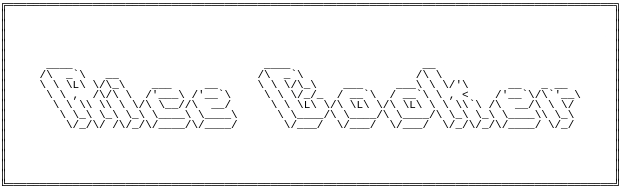

[](https://classroom.github.com/a/PHq8Kfj_)



# RICE COOKER Go Lang

Use `Effective Go` for code style and format

# Requirements

To run this project, you'll need to install Go. You can download and install it [here](https://go.dev/doc/install).

# Installation

1. Clone this repository

```sh
    git clone https://github.com/hei-school/cc-d2-my-rice-cooker-AmourRamanantsiresy.git
```

2. Go to the folder cc-d2-my-rice-cooker-AmourRamanantsiresy

```sh
    cd cc-d2-my-rice-cooker-AmourRamanantsiresy
```

3. Checkout to this current branch

```sh
    git checkout feature/go
```

4. Run the project

```sh
    go run cmd/main/main.go
```
